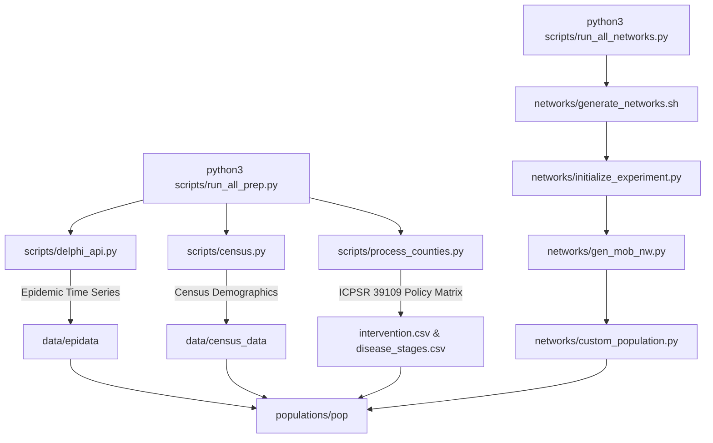
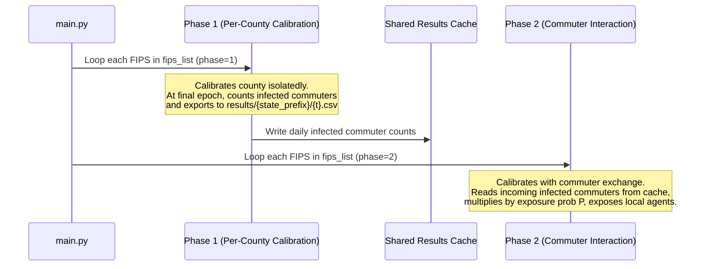

# Epidemic Differentiable ABM System Documentation

This document provides a comprehensive operational overview of the Differentiable Agent-Based Model (ABM) repository for COVID-19 transmission, metro calibration, and policy counterfactual evaluation.

---

## 1. System Architecture & Overview

The repository is built on **AgentTorch**, a PyTorch-native framework for agent-based modeling. It models epidemic transmission as a graph-based differentiable SEIR (Susceptible-Exposed-Infected-Recovered-Dead) simulation where disease dynamics are governed by agent interactions across household, school, occupational, and commuter contact networks.

Key architectural features:
* **Differentiable Parameters**: Core epidemiological parameters (e.g., transmission rate $R$, underreporting factor $k$, mortality rate $M$) are defined as PyTorch learnable parameters (`LearnableParams`) optimized via gradient descent against real-world case and death time series.
* **Graph-Based Mobility Networks**: Agents interact through structural graphs matching empirical demographics from US Census data.
* **Metro-Area Commuter Interaction**: Supports multi-county calibration where infected agents commuting between counties dynamically transmit infections across administrative borders.
* **Counterfactual Engine**: Simulates "what-if" policy interventions (school closures, workplace restrictions) by altering contact networks and compliance behavior over historical dates.

---

## 2. Step 1: Streamlined Data Preparation Pipeline

Data preparation generates synthetic digital populations, policy timelines, and structural contact networks for target counties. 

> [!IMPORTANT]
> **Streamlined Execution**: For bulk processing across all target counties, the entire pipeline is streamlined into running just **two master orchestrator scripts** in sequence:
> ```bash
> # 1. Fetch demographics, epidemic data, policy files & county folders
> python3 scripts/run_all_prep.py
> 
> # 2. Construct mobility, school, workplace, & commuter contact networks
> python3 scripts/run_all_networks.py
> ```

### Detailed Data Preparation Process & Internal Script Mechanics

Under the hood, `run_all_prep.py` and `run_all_networks.py` execute a sequence of specialized internal scripts. Here is what each script does:



#### 1. Demographic & Epidemiological Data Fetching (`run_all_prep.py`)
* **`scripts/delphi_api.py`**:
  * Queries CMU Delphi's COVIDcast API (using `COVIDCAST_API_KEY` from `.env`).
  * Downloads daily confirmed COVID-19 cases and deaths for each target county FIPS.
* **`scripts/census.py`**:
  * Queries the US Census Bureau API (using `CENSUS_API_KEY` from `.env`).
  * Fetches age distributions, household size statistics, and sector-by-sector employment numbers for target counties.
* **`scripts/process_counties.py`**:
  * Loads the ICPSR 39109 US County-Level Policy Database (`data/county_policy_data/39109-0001-Data.tsv`).
  * Extracts county-level school (`C1_SCHOOL`) and workplace (`C2_WORKPLACE`) closure mandates, falling back to state-level policies (`S_C1_SCHOOL`, `S_C2_WORKPLACE`) if county data is unmonitored.
  * Binarizes stringency levels and interpolates mandates into daily simulation dates, writing out `intervention.csv` and initial `disease_stages.csv`.

#### 2. Network Construction & Population Formatting (`run_all_networks.py`)
* **`networks/generate_networks.sh`**:
  * Automated shell wrapper that executes `initialize_experiment.py` in non-interactive mode.
* **`networks/initialize_experiment.py`**:
  * Master driver script for network generation for a given county FIPS.
  * Coordinates demographic sampling and invokes network construction functions in `networks/gen_mob_nw.py`.
* **`networks/gen_mob_nw.py`**:
  * Constructs the structural contact networks:
    * `HOUSEHOLD_NETWORK.pkl`: Watts-Strogatz/random graph connecting family members living in the same home.
    * `SCHOOL_NETWORK.pkl`: Bipartite student-school network based on census age distributions.
    * `occnets/`: Occupation-specific contact graphs for adult workers across 20 sector categories.
    * `commuter_networks/`: Cross-county commuting graphs using Census LODES commuting flow data.
* **`networks/custom_population.py`**:
  * Assembles age distributions (`age.pickle`), population mappings (`population_mapping.json`), and stage files into the target folder `populations/pop<FIPS>/`.

---

## 3. Step 2: Main Experiment & Model Calibration

The core simulation is managed by `abm_nets.py` and executed via `main.py`.

### Running `main.py`

`main.py` accepts one or more comma-separated FIPS codes:

```bash
python main.py <fips_code_1,fips_code_2,...>
```

#### A. Single-County Calibration (`Metro Calibration Phase 0`)

```bash
python main.py 39013
```

* Executes `run_county_phase("39013", phase=0)`.
* Calibrates parameters for a single isolated county (**Montgomery County, OH**).
* Saves optimized model weights and result plots in `results/` and `result_graphs/`.

#### B. Multi-County / Metro Area Calibration (`Phase 1` & `Phase 2`)

```bash
python main.py 39013,39081
```

When multiple FIPS codes are provided, `main.py` sequences calibration into two distinct phases to capture cross-county commuting dynamics:



1. **Phase 1 (Factoring Loop)**:
   * Loops through each FIPS code with `metro_calibration_phase: 1`.
   * Calibrates individual county parameters. During the final epoch, `covid_abm/substeps/new_transmission/transition.py` tracks infected agents who commute out of the county and writes daily infected commuter counts to `results/{state_prefix}/{t}.csv`.
2. **Phase 2 (Commuter Coupling Loop)**:
   * Loops through each FIPS code with `metro_calibration_phase: 2`.
   * Reads incoming infected commuters from `results/{state_prefix}/{t}.csv`.
   * Calculates exposure probability $P$ (mean susceptible exposure rate) and exposes local susceptible agents accordingly, capturing cross-border epidemic spreading.

---

## 4. Step 3: Counterfactual Policy Generation

Once model parameters are calibrated, counterfactual scenarios evaluate hypothetical policy interventions (e.g., toggling school closures or workplace restrictions).

### How Counterfactual Mode is Configured

> [!NOTE]
> Counterfactual mode can be configured in **two ways**:
> 
> 1. **Direct Configuration File (`covid_abm/yamls/config.yaml`)**:
>    Edit `covid_abm/yamls/config.yaml` directly:
>    ```yaml
>    simulation_metadata:
>      GENERATING_COUNTERFACTUAL: true  # Set to false for Calibration, true for Counterfactuals
>    ```
> 
> 2. **Environment Variable Override (Recommended for Scripts)**:
>    Set `GENERATING_COUNTERFACTUAL=true` in your shell when running `main.py`:
>    ```bash
>    GENERATING_COUNTERFACTUAL=true python main.py 39013
>    ```
>    *How it works*: `main.py` checks `if "GENERATING_COUNTERFACTUAL" in os.environ:` and dynamically overrides the `config.yaml` setting in memory. This is used by batch Slurm scripts like `run_sims_and_cf.sh`.

### Counterfactual Types (Scenarios)

Counterfactual scenarios are configured in `abm_nets.py` via `cf_types_to_run`:

| Type | School Mandate | Workplace Mandate | Scenario Description |
| :--- | :--- | :--- | :--- |
| **1** | 0 (Open) | 0 (Open) | **No Restrictions**: Both schools and workplaces remain fully open. |
| **2** | 1 (Closed) | 0 (Open) | **School Closure Only**: Schools closed, workplaces open. |
| **3** | 0 (Open) | 1 (Closed) | **Workplace Closure Only**: Schools open, workplaces closed. |
| **4** | 1 (Closed) | 1 (Closed) | **Full Closure**: Both schools and workplaces fully closed. |
| **5** | 0 (Open) | Factual | Schools open; workplace mandate follows historical dates. |
| **6** | 0 (Open) | Counterfactual | Schools open; workplace mandate is inverted ($0 \leftrightarrow 1$). |
| **7** | Factual | Factual | **Baseline Factual**: Matches exact historical policy mandates. |
| **8** | Counterfactual | Factual | School mandate is inverted ($0 \leftrightarrow 1$); workplace follows history. |
| **9** | Factual | Counterfactual | School follows history; workplace mandate is inverted ($0 \leftrightarrow 1$). |
| **10** | Counterfactual | Counterfactual | **Full Counterfactual**: Both school and workplace mandates are inverted. |

---

## 5. Repository File Map & Responsibilities

| Path | Purpose |
| :--- | :--- |
| [main.py](file:///home/facundoy/research/epi-diff-abm-dev/main.py) | Main execution CLI. Parses FIPS codes, configures `metro_calibration_phase`, and dispatches runs. |
| [abm_nets.py](file:///home/facundoy/research/epi-diff-abm-dev/abm_nets.py) | Simulation training loop, PyTorch `LearnableParams` model, loss computation, and counterfactual evaluator. |
| [covid_abm/yamls/config.yaml](file:///home/facundoy/research/epi-diff-abm-dev/covid_abm/yamls/config.yaml) | Master simulation YAML configuration (disease stages, learning rates, network paths, metadata). |
| [covid_abm/substeps/new_transmission/transition.py](file:///home/facundoy/research/epi-diff-abm-dev/covid_abm/substeps/new_transmission/transition.py) | Core SEIR transmission logic, infection probability computations, and commuter infection caching. |
| [scripts/run_all_prep.py](file:///home/facundoy/research/epi-diff-abm-dev/scripts/run_all_prep.py) | Master orchestrator script for demographic data fetching, API queries, and policy file processing. |
| [scripts/run_all_networks.py](file:///home/facundoy/research/epi-diff-abm-dev/scripts/run_all_networks.py) | Master orchestrator script for batch generating structural contact and commuting networks across counties. |
| [networks/initialize_experiment.py](file:///home/facundoy/research/epi-diff-abm-dev/networks/initialize_experiment.py) | Generates synthetic agent populations and structural contact graphs. |
| [scripts/process_counties.py](file:///home/facundoy/research/epi-diff-abm-dev/scripts/process_counties.py) | Processes Oxford/ICPSR policy databases into daily intervention matrices. |
| [run_sims_and_cf.sh](file:///home/facundoy/research/epi-diff-abm-dev/run_sims_and_cf.sh) | Slurm batch script to automate calibration and counterfactuals across county array jobs. |
| [docs/metro_area_changes.txt](file:///home/facundoy/research/epi-diff-abm-dev/docs/metro_area_changes.txt) | Detailed changelog for metro-area multi-county calibration logic. |
| [docs/policy_changes.txt](file:///home/facundoy/research/epi-diff-abm-dev/docs/policy_changes.txt) | Detailed changelog for policy parsing and ICPSR integration. |
